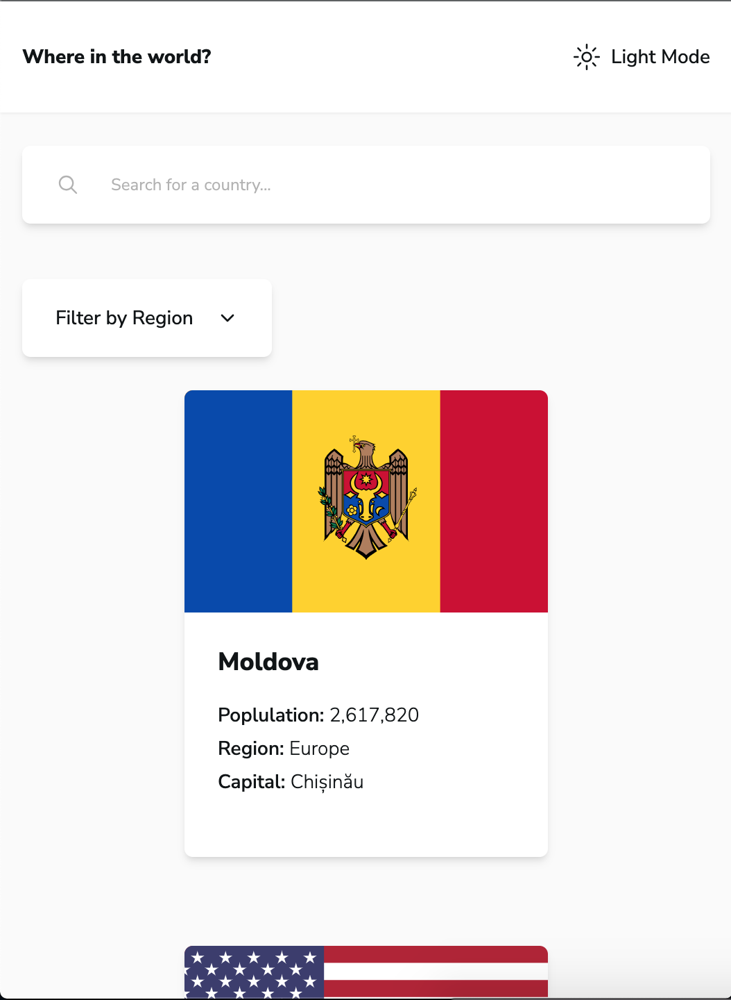
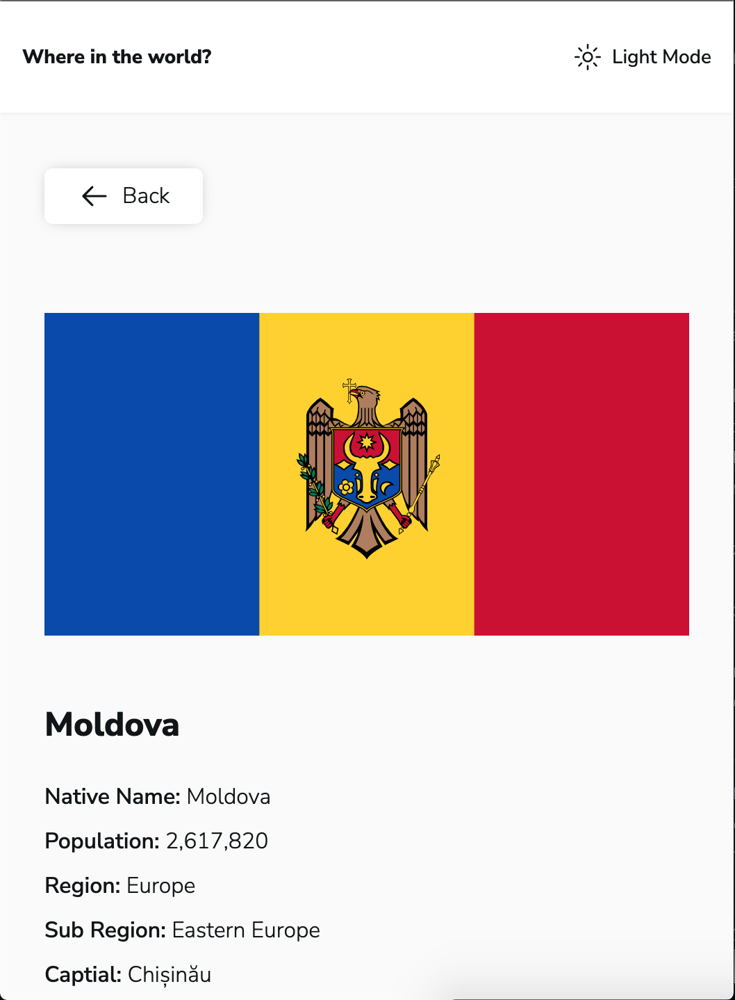
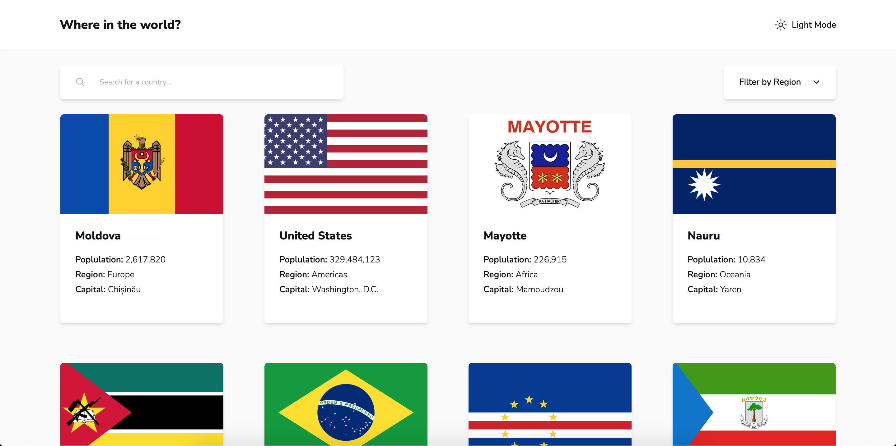
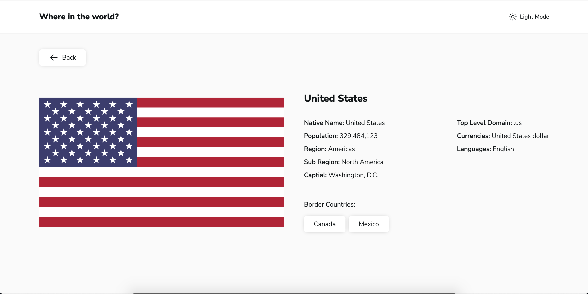

# Frontend Mentor - REST Countries API with color theme switcher solution

This is a solution to the [REST Countries API with color theme switcher challenge on Frontend Mentor](https://www.frontendmentor.io/challenges/rest-countries-api-with-color-theme-switcher-5cacc469fec04111f7b848ca). Frontend Mentor challenges help you improve your coding skills by building realistic projects.

## Table of contents

- [Overview](#overview)
  - [The challenge](#the-challenge)
  - [Screenshot](#screenshot)
  - [Links](#links)
- [My process](#my-process)
  - [Built with](#built-with)
  - [What I learned](#what-i-learned)
- [Continued development](#continued-development)
- [Author](#author)

## Overview

### The challenge

Users should be able to:

- See all countries from the API on the homepage
- Search for a country using an `input` field
- Filter countries by region
- Click on a country to see more detailed information on a separate page
- Click through to the border countries on the detail page
- Toggle the color scheme between light and dark mode _(optional)_

### Screenshot






### Links

- Solution URL: [https://www.frontendmentor.io/solutions/responsive-rest-countries-with-nextjs-14-server-side-rendering-shadcn-kLj-OY4bWH](https://www.frontendmentor.io/solutions/responsive-rest-countries-with-nextjs-14-server-side-rendering-shadcn-kLj-OY4bWH)
- Live Site URL: [https://fm-rest-countries-api-with-color-theme-switcher.vercel.app/](https://fm-rest-countries-api-with-color-theme-switcher.vercel.app/)

## My process

### Built with

- Semantic HTML5 markup
- CSS custom properties
- Flexbox
- CSS Grid
- Mobile-first workflow
- [Next.js](https://nextjs.org/) - React framework
- TypeScript
- TailwindCSS
- shadcn/ui

### What I learned

- Utilized `seachParams` in NextJS server component. Get and set data via searchParam.
  https://nextjs.org/docs/app/api-reference/functions/use-search-params#searchparams-optional

Get data from props of home page:

```ts
export default async function Home({
  searchParams,
}: {
  searchParams?: {
    country?: string;
    region?: string;
  };
}) {
  const country = searchParams?.country || "";
  const region = searchParams?.region || "";
```

Set data inside a component, for example `<Search />`:

```ts
const Search = () => {
  const searchParams = useSearchParams();
  const pathname = usePathname();
  const { replace } = useRouter();

  // Debouncing, execute below code when user finish typing after 300ms.
  const handleSearch = useDebouncedCallback((term) => {
    const params = new URLSearchParams(searchParams);

    if (term) {
      params.set("country", term);
    } else {
      params.delete("country");
    }
    replace(`${pathname}?${params.toString().toLowerCase()}`);
  }, 300);
```

- Similar with `useParams` to pass data via route parameter
  https://nextjs.org/docs/app/api-reference/functions/use-search-params#params-optional

Get data from URL:

```ts
//  .../detail/[countryCode]/page.tsx
export default async function Page({
  params: { country: cca3 },
}: {
  params: { country: string };
}) {
  return (
    <main className="min-h-[calc(100vh_-_80px)] container mx-auto px-8 py-10 lg:px-4">
      <BackButton />
      <Suspense fallback={<DetailSkeleton />}>
        <CountryDetail cca3={cca3} />
      </Suspense>
    </main>
  );
}
```

- React Suspense and Skeleton as a fallback

```ts
import { Suspense } from "react";
import { DetailSkeleton } from "@/components/ui/skeletons";

// ... somewhere used in a async component
<Suspense fallback={<DetailSkeleton />}>
  <CountryDetail cca3={cca3} />
</Suspense>;
```

### Continued development

- I prefer to add pagination for this challenge to enhance performance. Maybe 20 countries for the first load and add a new section with another 20 countries when user scroll to bottom (infinity load).

## Author

- Website - [Kenny Ng](https://github.com/kennylun123)
- Frontend Mentor - [@kennylun123](https://www.frontendmentor.io/profile/kennylun123)
- Twitter - [@kenny_ng123](https://www.twitter.com/kenny_ng123)
